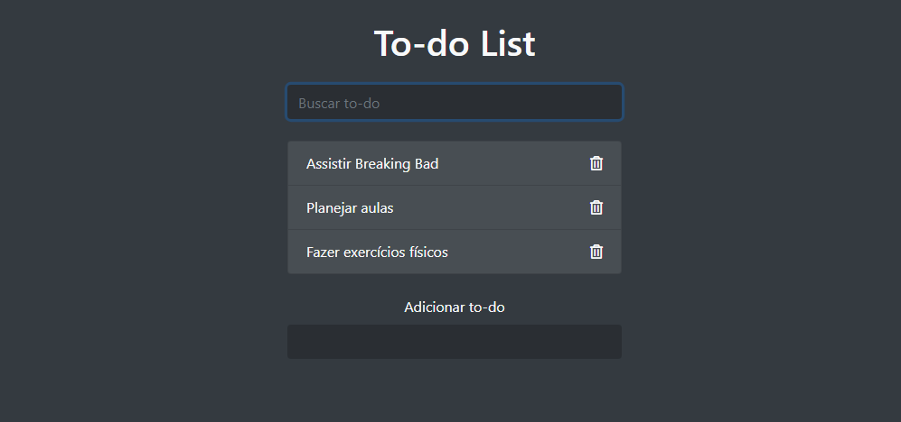

# Todo-List

### Projeto desenvolvido durante o treinamento de javascript puro do Roger Melo - CJRM

Tecnologias utilizadas:
- Para o  layout foi usado BootStrap 4.3.1
- Html 5
- JavaScript

Deploy no **netlify**

[link do site:]()

